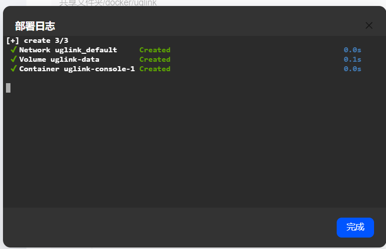
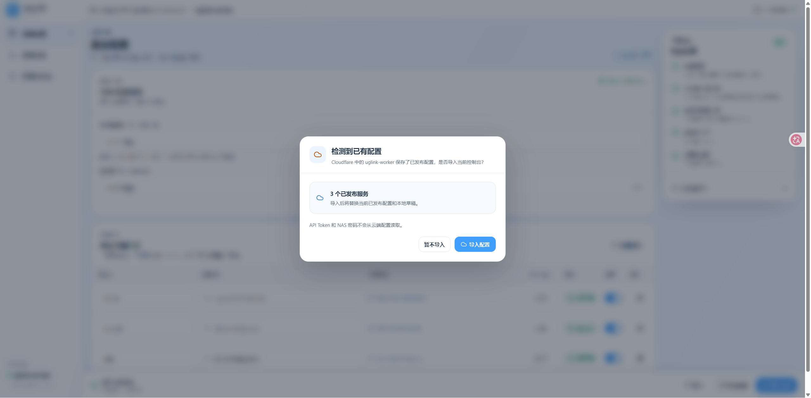
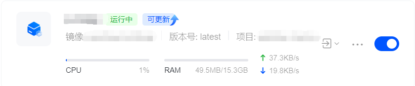

# 部署 UGLINK Worker NAS

管理控制台可以运行在本地 Docker 或 Cloudflare Workers。两种方式都把 Gateway 部署到 Cloudflare，访问 NAS 时无需经过本地控制台。

## Cloudflare 账户与权限

### 获取 Cloudflare Account ID

登录 [Cloudflare Dashboard](https://dash.cloudflare.com)，进入 **Workers & Pages** 页面，在右侧即可找到你的 Account ID：

<p align="center">
  
</p>

### 创建 API Token

前往 [API Tokens](https://dash.cloudflare.com/profile/api-tokens) 页面创建一个自定义 Token，所需权限如下：

<p align="center">
  
</p>

> [!WARNING]
> **不要使用 Global API Key。** 只需要授予以下最小权限，并把范围限制到目标账户：
>
> | 权限                         | 级别 |
> | ---------------------------- | ---- |
> | Account / Workers Scripts    | Edit |
> | Account / Workers KV Storage | Edit |
>

## 在绿联云 NAS 的 Docker 应用中部署

在绿联云 NAS 的应用中心安装并打开 **Docker** 应用。以下步骤都在图形界面中完成，无需 SSH 或命令行。

### 1. 创建项目并填写 YAML

进入 Docker 的「项目」页面，创建项目：

- **项目名称**：填写 `uglink`。
- **存放路径**：选择用于保存项目文件的文件夹，例如 `共享文件夹/docker/uglink`。
- **Compose 配置**：将下面的 YAML 完整粘贴到编辑框中。

```yaml
name: uglink

services:
  console:
    image: ghcr.io/leonis-q-f/uglink-worker-nas:latest
    init: true
    restart: unless-stopped
    ports:
      - "5173:8787"
    volumes:
      - uglink-data:/data
    read_only: true
    tmpfs:
      - /tmp:size=64m,mode=1777
    cap_drop:
      - ALL
    security_opt:
      - no-new-privileges:true
    stop_grace_period: 20s

volumes:
  uglink-data:
    name: uglink-data
```

如果 NAS 的 `5173` 端口已被占用，将 `"5173:8787"` 改为例如 `"5180:8787"`，右侧容器端口 `8787` 保持不变。此配置直接使用发布镜像，不需要下载源码或额外创建 `.env` 文件。

勾选「创建完成后立即运行」，点击「立即部署」。

<p align="center">
  
</p>

### 2. 等待部署并确认容器运行

等待镜像下载和项目创建完成。部署日志会显示网络、数据卷和容器的创建结果，点击「完成」返回。

<p align="center">
  
</p>

进入「容器」页面，找到 `uglink-console-1`，确认状态为「运行中」。通过容器右侧的访问入口选择 `5173:8787`，或在浏览器中打开 `http://你的NAS局域网IP:5173`。如果前面修改了主机端口，这里也使用修改后的端口。

<p align="center">
  
</p>

日志中的 `Created` 只表示资源已创建。如果容器反复重启或网页无法打开，请查看容器日志，确认是否出现启动错误。

### 3. 连接 Cloudflare 并按需导入配置

打开控制台后，填写前面准备好的 **Cloudflare Account ID** 和 **API Token**，选择目标 Worker 名称并连接。

如果该 Worker 已保存本项目的已发布配置，控制台会提示「检测到已有配置」。需要恢复时点击「导入配置」；首次使用时没有该提示，直接继续配置即可。

<p align="center">
  
</p>

导入会替换当前控制台的已发布配置和本地草稿。API Token 和 NAS 密码不会从云端配置读取。

### 4. 填写 NAS 信息并发布服务

在「服务配置」页面完成以下设置：

1. 填写 **UGREENlink ID**，即 `https://ug.link/` 后的设备 ID，并确保 NAS 已启用 UGREENlink 远程访问。
2. 填写 **NAS 本地登录用户名和密码**。首次发布必须填写密码，后续发布留空则保留已部署的密码。
3. 点击「添加服务」，填写服务名称、完整域名和 NAS 端口，并启用服务。每项服务使用独立子域名，所属域名需已托管到当前 Cloudflare 账户。
4. 点击「检查配置」，确认后点击「发布更改」，等待发布完成，再通过服务域名访问对应应用。

<p align="center">
  
</p>

控制台配置和自动生成的会话加密密钥保存在 Docker 的 `uglink-data` 数据卷中，并非项目存放路径下的普通文件。重建或更新容器时保留该卷；已有同名卷会被复用。配置检查通过不代表 NAS 后端应用一定可达，发布后仍需实际访问验证。

### Compose 配置

上面的图形界面教程已将镜像和端口直接写入 YAML，需要调整时编辑对应字段即可。以下变量适用于使用仓库原始 [compose.yaml](../compose.yaml) 的部署方式。

下列变量写入 Compose 项目目录的 `.env`。完整示例见 [`.env.example`](../.env.example)。

| 变量                    | 说明                                      | 默认值                                          |
| ----------------------- | ----------------------------------------- | ----------------------------------------------- |
| `UGLINK_BIND_ADDRESS` | 主机监听地址；仅本机使用时填`127.0.0.1` | `0.0.0.0`                                     |
| `UGLINK_CONSOLE_PORT` | 主机端口                                  | `5173`                                        |
| `UGLINK_IMAGE`        | 镜像地址及版本                            | `ghcr.io/leonis-q-f/uglink-worker-nas:latest` |

### 会话加密密钥

Docker 首次启动自动生成会话加密密钥并保存在数据卷中，通常无需手动设置。

如果必须提供自己的密钥，先用下面的命令生成 32 字节 base64url 密钥，保存在密码管理器中：

```bash
node -e "console.log(require('node:crypto').randomBytes(32).toString('base64url'))"
```

在 `.env` 中添加 `SESSION_ENCRYPTION_KEY`，并在现有 `compose.yaml` 的 `services.console` 下添加以下配置，其他字段保持原样：

```yaml
environment:
  SESSION_ENCRYPTION_KEY: "${SESSION_ENCRYPTION_KEY:?Set SESSION_ENCRYPTION_KEY in .env}"
```

仅在 `.env` 中设置变量不会自动传入容器。密钥变更后，旧的加密会话将无法读取；迁移时应保留原密钥。

### 更新

在绿联云 NAS 的 **Docker → 容器** 页面中更新，无需命令行：

1. 更新前查看 [Release 说明](https://github.com/Leonis-Q-F/uglink-worker-nas/releases)，并按 [数据持久化与备份](#数据持久化与备份) 备份整个数据卷；也建议另外导出一份加密配置备份。
2. 找到 `uglink-console-1`。检测到新镜像时，容器名称旁会显示「可更新」标记，如下图所示。
3. 点击该容器的「可更新」入口，按界面提示完成更新，保留原有的 `uglink-data` 数据卷。
4. 等待容器恢复「运行中」，重新打开控制台，确认原有配置正常。

<p align="center">
  
</p>

前面的 YAML 使用 `latest` 镜像标签。需要固定版本时，在项目的 Compose 配置中，将 `image` 末尾的 `latest` 改为所需的已发布版本标签。更新过程中不要删除数据卷，控制台配置和会话加密密钥都保存在其中。

更新控制台不会自动更新已经部署的 Gateway。涉及网关变更时，请按照 [Release 说明](https://github.com/Leonis-Q-F/uglink-worker-nas/releases)，在更新后的控制台进入「故障诊断 → 覆盖部署」。该操作使用已发布配置更新项目管理的同名 Worker，保留现有 NAS 密码，无需修改服务配置来启用发布按钮。

## 数据持久化与备份

### 备份范围与注意事项

- Docker 的 `uglink-data` 卷挂载到容器的 `/data`，不在 NAS 项目的存放路径下。卷内的 `console.sqlite` 保存控制台数据，包括加密会话、服务配置、草稿与诊断记录；自动生成的会话密钥保存在隐藏文件 `.dev.vars` 中。SQLite 的 `console.sqlite-wal`、`console.sqlite-shm`（若存在）以及旧版 `wrangler` 目录也要一起备份，不能只复制数据库主文件。
- **完整卷备份前先停止所有使用该卷的控制台，确认没有写入，再备份整个卷，包括隐藏文件。** 更新或重建容器时保留数据卷，不要执行 `docker compose down --volumes`，也不要在 NAS 界面删除数据卷。
- 如果通过环境变量自行提供 `SESSION_ENCRYPTION_KEY`，它不一定在卷内；需另外安全保存原密钥，并在恢复时注入同一密钥。项目的 Compose YAML、`.env`（若使用）和原镜像版本也应另外保存；不要把这些敏感文件提交到仓库。
- 卷归档只是压缩文件，**没有加密**，而且可能同时包含加密 API Token 和解密密钥。应限制访问权限，保存在受保护、最好加密的存储中，并另留一份异机副本。应用导出的加密备份及其密码也需妥善保管，不要上传到 Issue 或公开分享。
- 已发布的非秘密配置会同步到目标 Worker 的 `UGLINK_CACHE` KV，但 API Token、NAS 密码和本地草稿不会同步；「导入云端配置」不能代替完整备份。NAS 密码保存在 Gateway 的 Worker Secret 中，无法回读，因此卷备份和加密配置备份都不包含它。重建 Gateway 时需重新提供 NAS 密码。

### 在控制台导出和恢复加密配置备份

此方式可在网页中完成，适合转移当前 Cloudflare 连接和配置，但不是整个数据卷的快照。

1. 在已连接的控制台找到「加密备份与恢复」，点击「导出备份」。设置并确认独立的 **12–256 个字符**备份密码，保存下载的 JSON 文件。导出包含当前连接的 API Token、目标 Worker、UGREENlink ID、NAS 登录用户名、已发布配置、本地草稿及最多 100 条诊断记录，不包含 NAS 密码。
2. 恢复前先备份现有配置。在初始连接页面或「加密备份与恢复」中点击「恢复备份」，选择 JSON 文件，输入原备份密码，再点击「验证并恢复」。恢复时会连接 Cloudflare 验证备份里的 API Token，需能访问 Cloudflare 且 Token 仍有效。
3. 恢复会替换备份目标在当前控制台中的已发布配置、草稿和对应诊断记录，并恢复连接；不会自动重新部署线上 Gateway。先核对账户、Worker 和服务，再按需发布。

### 完整数据卷备份（需要 SSH 或终端）

NAS 图形界面部署和更新步骤保持不变。下面是可选的 Docker 命令行备份方式，需要能在 NAS 上运行 Docker 命令；若使用 NAS 备份工具，也必须确认它覆盖实际数据卷、隐藏文件和文件权限，并在控制台停止期间完成备份，而不是只复制项目文件夹。

示例使用上文默认的容器名 `uglink-console-1` 和卷名 `uglink-data`。先用 `docker inspect uglink-console-1` 确认挂载到 `/data` 的卷名称；自定义名称时请相应替换，确保该卷没有其他运行中的写入者。备份目录应位于有足够空间的持久存储上。

```bash
(
  set -eu
  umask 077
  mkdir -p backup
  archive="$PWD/backup/uglink-data-$(date +%Y%m%d-%H%M%S).tgz"
  docker volume inspect uglink-data >/dev/null
  docker pull alpine:3.22
  docker stop --time 20 uglink-console-1
  test "$(docker inspect -f '{{.State.Running}}' uglink-console-1)" = false
  docker run --rm --network none --mount type=volume,src=uglink-data,dst=/data,readonly \
    alpine:3.22 tar czf - -C /data . > "$archive"
  tar tzf "$archive" >/dev/null
  sha256sum "$archive" > "$archive.sha256"
  docker start uglink-console-1
  printf '备份文件：%s\n' "$archive"
)
```

命令失败会中止后续步骤；如果容器已停止，排查后执行 `docker start uglink-console-1` 恢复控制台，不要把不完整归档当作有效备份。归档列表检查和校验和不能替代恢复演练。停止本地控制台不会停止已发布的云端 Gateway。

### 从完整卷备份恢复

1. 保存当前 Compose 配置和镜像版本，并先为当前卷再做一份备份。停止原控制台，确认没有其他容器写入恢复目标。选择可信的、已验证的备份；回退版本时优先使用备份时的镜像版本。
2. **恢复到一个新的空卷，保留原卷，避免覆盖现有数据。** 将下例归档路径换成实际文件；校验和文件使用上面备份命令生成的路径，移动备份后需相应调整校验文件里的路径。新卷名也要确保未被其他项目使用。

```bash
(
  set -eu
  archive="$PWD/backup/uglink-data-YYYYMMDD-HHMMSS.tgz"
  restored_volume="uglink-data-restored-$(date +%Y%m%d-%H%M%S)"
  sha256sum -c "$archive.sha256"
  tar tzf "$archive" >/dev/null
  docker pull alpine:3.22
  if docker volume inspect "$restored_volume" >/dev/null 2>&1; then
    printf '目标卷已存在，请更换卷名后重试。\n' >&2
    exit 1
  fi
  docker volume create "$restored_volume"
  docker run --rm -i --network none \
    --mount "type=volume,src=$restored_volume,dst=/data" alpine:3.22 \
    sh -ec 'test -z "$(ls -A /data)"; tar xzpf - -C /data' < "$archive"
  printf '恢复卷名：%s\n' "$restored_volume"
)
```

3. 只在解包成功后，在 NAS 项目的 Compose YAML（或本地 `compose.yaml`）中把底部 `volumes.uglink-data.name` 的值从 `uglink-data` 改为上一步输出的恢复卷名，并在该卷定义下添加 `external: true`（与 `name` 同级），明确使用已恢复的外部卷，保留服务中的 `uglink-data:/data` 映射。若原来注入了会话密钥，恢复原值。通过 NAS 项目重新部署容器；命令行部署则在原 Compose 项目目录执行 `docker compose up -d --no-build`。仅启动旧容器不会切换挂载。
4. 确认新容器的 `/data` 挂载指向恢复卷，检查日志、控制台配置、草稿与服务访问。卷内文件需保留归档中的权限和所有者，当前镜像使用 UID/GID `1000:1000`；遇到权限或密钥错误先排查，不要通过删除卷或重新生成密钥来“修复”。浏览器 Cookie 或服务端会话过期后仍可能需要重新连接 Cloudflare。

验证完成前保留原卷和备份。恢复本地卷不会回滚 Cloudflare 上的 Worker、Secret 或域名设置，若需回滚线上网关，应另按对应版本的 Release 说明处理。

### 从旧版 Wrangler 容器迁移与回退

首次启动新版时会从 `/data/wrangler/v3/kv` 事务性导入未过期的旧记录，保留原密钥和旧文件；完成后不会重复导入。旧数据布局不支持或迁移所需文件缺失时会启动失败，不会静默清空配置。升级前先停止旧容器并备份整个卷，不要让新旧版本同时写同一个卷。

旧镜像只读取旧 KV 文件，看不到升级后写入 SQLite 的更改。需要回退时，应使用升级前的完整卷备份和对应旧镜像；若要保留升级后的最新配置，可先导出加密配置备份，再确认目标版本支持后恢复。

## 将管理控制台部署到 Cloudflare

此方式不需要 Docker。建议使用 Node.js 22.13+ 的 22.x 版本和 npm 10+。

```bash
git clone https://github.com/Leonis-Q-F/uglink-worker-nas.git
cd uglink-worker-nas
npm ci
npx wrangler login
npx wrangler kv namespace create CONSOLE_SESSIONS --config wrangler.jsonc
```

将创建结果中的命名空间 ID 填入 `wrangler.jsonc` 的 `kv_namespaces`，替换 `CONSOLE_SESSIONS` 对应的全零占位 ID。按需修改 `name`；后续密钥配置和部署必须使用同一个 Worker 名称。

然后配置控制台会话密钥。以下命令直接通过标准输入提交新密钥，不把密钥写入仓库：

```bash
npm run --silent secret:key | npx wrangler secret put SESSION_ENCRYPTION_KEY --config wrangler.jsonc
```

如果 Wrangler 提示目标 Worker 尚不存在，确认创建。已有部署迁移时应使用原密钥，不要随意重新生成。

```bash
npm run deploy:console
```

部署成功后通过 Wrangler 输出的地址打开控制台，并在控制台连接目标 Cloudflare 账户。Wrangler 的登录用于部署控制台，不替代控制台内的 API Token 连接。

云端控制台应配置访问控制。`.dev.vars` 只用于本地开发，不会替代生产环境的 Worker Secret。

返回 [项目首页](../README.md)。

## 多入口与反向代理来源配置

Docker 控制台默认自动适配局域网 HTTP 与 HTTPS 反向代理入口，不依赖厂商品牌或固定域名。保持原 YAML，更新镜像、重新部署并刷新页面即可；不需要新增环境变量。即使代理改写 Host、缺少 Forwarded/X-Forwarded-*，也可以通过控制台页面访问。代理需正常转发应用自定义请求头和 Cookie，不改写浏览器 Origin。

控制台页面从首次初始化开始携带当前页面来源。服务端验证该来源、浏览器 Fetch Metadata（存在时）及 Origin，并保留写操作的 CSRF Token 检查；拒绝跨域预检。来源识别不代替登录认证，远程入口仍需 HTTPS 和访问认证保护。

以下是需要限制来源或管理可信代理时的**可选高级配置**。设置固定来源、允许来源列表、Host 映射或启用代理头模式后，自动识别不覆盖这些策略。

### 仅局域网直连

默认无需增加配置。若要限制可访问地址，在 Docker 项目的 `services.console.environment` 中填写完整来源，例如 `UGLINK_ALLOWED_ORIGINS: 'http://nas.example.test:5173'`。实际使用时将示例替换为 NAS 的局域网 IP 或域名及端口。

### 保留外部 Host 的入口（包括符合此条件的绿联远程入口）

在 Docker 图形界面编辑项目 YAML，把以下内容加在 `console` 服务下，与 `ports`、`volumes` 同级。替换成自己浏览器地址栏的精确域名和端口，然后重新部署项目，保留原数据卷。

```yaml
environment:
  UGLINK_ALLOWED_ORIGINS: 'http://nas.example.test:5173,https://relay.example.net,https://console.example.com'
  UGLINK_PROXY_HEADER_MODE: 'off'
  UGLINK_HOST_ORIGIN_MAP: '{"relay.example.net":"https://relay.example.net","console.example.com":"https://console.example.com"}'
```

映射只为同一个 Host 明确协议，不允许把内部主机名换成另一外部域名；首次不带 Origin 的 bootstrap GET 也会得到正确的 Secure Cookie。非默认端口必须同时写在来源及映射 key 内。

### 能清洗转发头的标准代理

```yaml
environment:
  UGLINK_ALLOWED_ORIGINS: 'http://nas.example.test:5173,https://console.example.com'
  UGLINK_TRUSTED_PROXY_CIDRS: '192.0.2.10/32'
  UGLINK_PROXY_HEADER_MODE: 'x-forwarded-single'
```

`192.0.2.10` 是文档保留地址，必须替换为应用实际看到的代理 socket 对端。代理应在独立受控网络上连接应用，清除客户端的 `Forwarded` 和所有 `X-Forwarded-*`，再设置单值 `X-Forwarded-Host: console.example.com` 与 `X-Forwarded-Proto: https`。外部端口放在 Host 中，应用不采用 `X-Forwarded-Port`。

也可选择 `forwarded-single`，由代理输出一组 `Forwarded: host=console.example.com;proto=https`；带端口或 IPv6 的 host 应使用 RFC 引号语法，例如 `host="[2001:db8::1]:8443"`。两个头族不混用，不接受逗号列表、重复头或重复参数。可信代理缺少完整元数据时仅能退回命中的精确 Host 映射，否则拒绝请求。

**不要直接信任 Docker 网关、所有私网或回环地址。** 若直连请求经 NAT 后也显示为该对端，客户端可以伪造代理头。应隔离代理网络、限制入口可达性，或使用精确 Host 映射。应用默认不会自动信任任何这些地址。

### 参数与兼容性

| 参数 | 默认 | 用途 |
| --- | --- | --- |
| `UGLINK_ALLOWED_ORIGINS` | 空 | 逗号分隔的精确 `http(s)://host[:port]`，不带路径、末尾斜杠、通配符、查询或片段 |
| `UGLINK_TRUSTED_PROXY_CIDRS` | 空 | 精确 IP/CIDR，支持 IPv4、IPv6、IPv4-mapped IPv6；只检查 socket 对端 |
| `UGLINK_PROXY_HEADER_MODE` | `off` | `off`、`x-forwarded-single`、`forwarded-single` |
| `UGLINK_HOST_ORIGIN_MAP` | `{}` | JSON 对象，精确 Host 到同 authority 的完整来源映射，值必须在允许列表内 |
| `UGLINK_PUBLIC_ORIGIN` | 空 | 弃用的单一固定来源兼容项，不能与非空多入口配置混用 |

无效配置启动失败；未允许的目标返回 `421 unconfigured_origin`，代理头不完整或冲突返回 `400 invalid_proxy_headers`，可信代理完全缺少元数据返回 `400 proxy_context_missing`，浏览器来源与本次目标不同返回 `403 invalid_origin`。即使两个地址都在允许列表中，也不允许互相跨来源写入。缺少 Origin 的兼容请求仍须有效会话及 CSRF Token。精确 `GET /api/health` 不创建会话，可独立用于容器健康检查。

本仓库 Compose 已显式注入这些参数。只有选择上述高级配置时，GUI YAML 才需要增加对应的 `environment`；默认自动模式无需改动 YAML。只修改用于 Compose 插值的 `.env` 并不代表参数进入了容器。

不同域名和 LAN IP 使用各自 host-only Cookie，可能需要分别连接 Cloudflare；不提供跨域登录同步。自动模式按完整来源区分 Cookie 名，使同主机名不同端口/协议可以分别使用。bootstrap 会刷新已有 Cookie 属性但不延长服务端会话期限。回滚后浏览器可能仍保存 Secure Cookie，必要时仅清除对应站点 Cookie，保留服务端数据卷与加密密钥。

自动模式会将会话绑定到经过验证的浏览器来源。旧会话首次升级时保留连接、会话 ID 和有效期，并迁移到对应来源的 Cookie 名。其他入口创建独立会话，不覆盖旧入口。强行将已绑定会话移植到另一来源会返回 `403 session_origin_mismatch`，不删除原会话或改写 Cookie。Cookie 分名不改变浏览器本身按域发送 Cookie 的规则，不能防御同主机其他服务窃取 Cookie。

代理若删除自定义请求头、修改浏览器 Origin 或干预跨域策略，需要修正代理行为或选择上述显式配置；应用不会因为域名属于某个厂商而自动放行。
